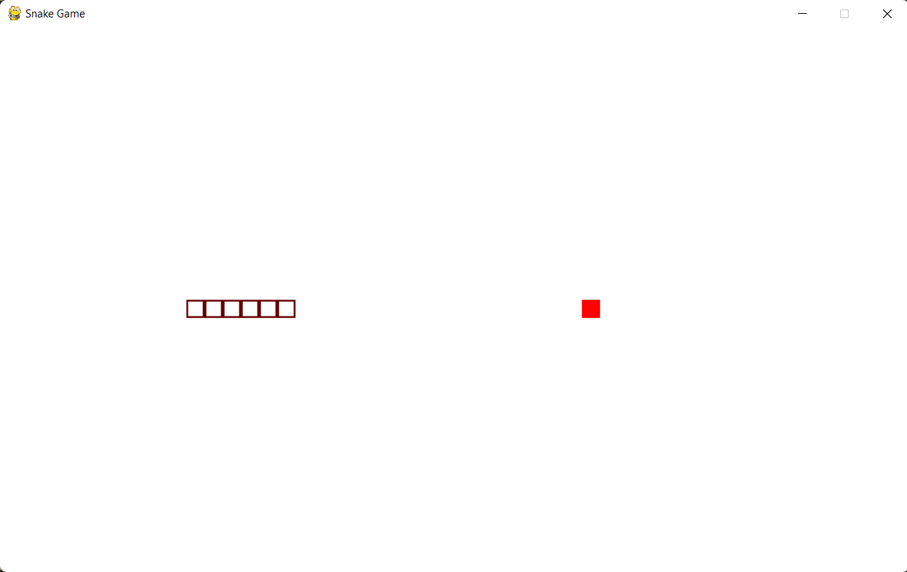

# Snake Game

This is a GUI based game using PyGame (python gaming library).

## Running snake game
1. Install pygame library `pip install pygame`
2. Run `python Snake.py`

## How to use
1. In order to eat food to snake you can make use of UP, DOWN, LEFT and RIGHT arrow keys to move in the respective directions. 
2. Remember, if the snake crosses the boundary line the game will end.
3. After then, you can have 2 options whether to quit (press 'Q') the game or to begin again (press 'C').

## Screenshots

Read my article about **'Introduction to PyGame'** at [Medium](https://medium.com/@shindepallavi563/introduction-to-pygame-37820b9b2d92)